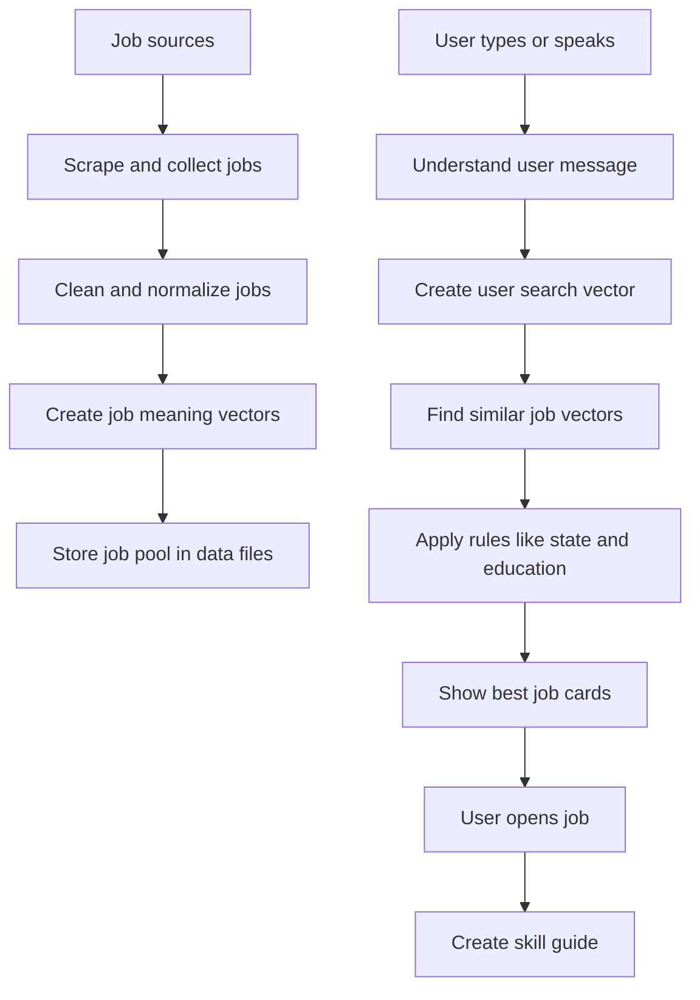

# CareerSetu Simple Architecture

This document explains CareerSetu in very simple language.

Imagine a student asks:

```text
I am 12th pass from Rajasthan. I know typing and computer. What job can I get?
```

CareerSetu's job is to understand this person and show jobs that make sense for them.

## 1. Why This Product Exists

Most job websites expect users to know exact search words.

They expect the user to search like this:

```text
data entry executive Jaipur fresher
```

But many real users search like this:

```text
I am 12th pass. I know computer. I need work near home.
```

CareerSetu is built for the second type of user.

The product should help people who:

- do not know exact job titles
- are 10th pass, 12th pass, ITI, diploma, graduate, or fresher
- speak in Hindi, English, Hinglish, Bengali, Marathi, or other Indian languages
- want simple guidance, not confusing filters
- need to know what to learn before applying

The goal is not just to show jobs. The goal is to help the user understand:

- which jobs they can try
- why those jobs fit
- what skill gap they have
- how to prepare
- how to apply

## 2. Where The Job Pool Comes From

CareerSetu needs a pool of jobs before it can search.

Think of this like a school library.

Before a student can find the right book, the library must already have books on the shelves.

For CareerSetu, the "books" are job records.

Current and planned job sources:

| Source | What it gives us | Current use |
| --- | --- | --- |
| JobSpy / Indeed-style scraping | Private jobs like data entry, sales, support, office, delivery, accounts | Used now |
| NCS.gov.in | Public/government-backed jobs | Small sample used now |
| Apprenticeship India | Apprenticeship roles for ITI, diploma, 10th/12th pass users | Planned |
| State portals | State-specific government/semi-government opportunities | Planned |
| Company career pages | Direct employer jobs | Planned |

Current job files:

```text
data/opportunities.json
data/enriched_opportunities.json
data/job_embeddings.json
```

Simple meaning:

- `opportunities.json` is the main job list.
- `enriched_opportunities.json` is the cleaned and easier-to-read version.
- `job_embeddings.json` is the meaning map for each job.

## 3. The Whole System In One Picture



## 4. What Happens When A User Searches

User says:

```text
Main Rajasthan se hoon, 12th pass hoon, typing aati hai.
```

CareerSetu does this:

1. If the user spoke, convert voice to text.
2. Convert the meaning into clean English.
3. Understand important facts.
4. Search the job pool by meaning.
5. Apply rules like location and education.
6. Show matching jobs.

## 5. Each AI Call In Simple Terms

CareerSetu does not use one big AI call for everything.

Each AI call has a small job.

### AI Call 1: Speech To Text

Used when the user speaks.

Example:

```text
User speaks: Main barahvi pass hoon Rajasthan se
```

AI returns:

```text
Main barahvi pass hoon Rajasthan se
```

Why this is important:

Many users may prefer speaking instead of typing, especially in regional languages.

Model used:

```text
OPENROUTER_STT_MODEL=openai/gpt-4o-transcribe
```

### AI Call 2: Intent Understanding

Used to understand what the user actually means.

Example input:

```text
I am 12th pass from Rajasthan. I know typing and computer.
```

Expected simple output:

```json
{
  "state": "Rajasthan",
  "education": "12th pass",
  "skills": ["typing", "basic computer"],
  "desired_roles": ["data entry", "back office", "computer operator"]
}
```

Why this is important:

The app needs hard facts. Rajasthan is not just a word. It means location filter. 12th pass is not just a word. It means education filter.

Model used:

```text
OPENROUTER_CHAT_MODEL=openai/gpt-4o-mini
```

Why a small model is enough:

This task is simple. We only need to extract facts, not write a long answer.

### AI Call 3: Profile Extraction

Used to fill the user's profile from natural language.

Example:

```text
I am B.Com graduate from West Bengal. I know Excel and Tally.
```

Profile becomes:

```json
{
  "state": "West Bengal",
  "education": "graduate",
  "degree": "B.Com",
  "skills": ["Excel", "Tally", "accounts"]
}
```

Why this is important:

Later the user should not repeat the same details again and again. The product can remember useful profile fields.

Model used:

```text
OPENROUTER_CHAT_MODEL=openai/gpt-4o-mini
```

### AI Call 4: Embedding / Vector Creation

Used for semantic job search.

Simple meaning:

AI turns text into numbers.

Example text:

```text
12th pass Rajasthan typing basic computer data entry back office fresher
```

Becomes a vector:

```text
[0.02, -0.11, 0.45, 0.08, ...]
```

Every job also has a vector already stored.

Example:

```text
Back Office Executive, Jaipur, data entry, Excel
```

also becomes numbers.

Then the system checks which job vectors are closest to the user vector.

Why this is important:

The user may say "typing job", but the job title may say "back office executive". Vector search helps match the meaning even when words are different.

Model used:

```text
OPENROUTER_EMBEDDING_MODEL=openai/text-embedding-3-small
```

Important detail:

The embedding model creates the query vector. But the comparison with job vectors happens in our own code using local files.

### AI Call 5: Skill Guide

Used only after the user opens a job and asks for help.

Example:

```text
Selected job: Customer Support Executive
User says: I know Hindi, WhatsApp, and basic computer.
```

The AI creates:

- what the job does daily
- what the user already knows
- what is missing
- what to learn first
- what can be learned on the job
- practice tasks
- YouTube search ideas
- interview questions
- apply checklist

Why this is important:

This is where the product becomes more than a job board. It helps the user become ready for the job.

Model used:

```text
OPENROUTER_GUIDE_MODEL=openai/gpt-4o
```

Why a stronger model is used here:

The skill guide needs better reasoning. It must be practical, not generic.

## 6. Why We Need Both Intent And Vector Search

Vector search is good for meaning.

Intent is good for rules.

Example:

```text
User: I am 12th pass from Rajasthan. I know typing.
```

Vector search may find:

- data entry executive
- back office executive
- customer support executive
- account executive
- CA article assistant

Some are good. Some are wrong.

Intent/rules fix this:

- Rajasthan means prefer Rajasthan, remote, or all-India jobs.
- 12th pass means avoid jobs that clearly need B.Com, CA, B.Tech, MBA, or senior experience.
- typing means boost data entry, computer operator, back office.
- if the user did not say CA, reduce CA articleship.

So the final search is:

```text
Vector search finds possible jobs.
Intent rules decide which ones are actually suitable.
```

## 7. How We Keep AI Cost Low

Bad expensive approach:

```text
Send all 50,000 jobs to AI and ask it to choose.
```

CareerSetu approach:

```text
Send only the user's sentence to AI.
Use vectors and rules to search jobs.
Send only one selected job to the guide model.
```

That means:

- search does not send the full job database to AI
- job vectors are precomputed
- the app compares vectors locally for the prototype
- the big model is used only when a user asks for a skill guide

## 8. Current Prototype Vs Future Architecture

Current:

```text
JSON job files
local job embeddings file
OpenRouter for AI calls
browser local storage for saved/applied jobs
GitHub Actions cron for data refresh
Vercel for hosting
```

Future:

```text
Neon Postgres for jobs and users
pgvector for indexed vector search
cron jobs for scraping and cleaning
profile system for each user
saved/applied jobs stored in database
cached skill guides
better Indian-language voice system
```

## 9. Very Simple Summary

CareerSetu works like this:

```text
Collect jobs
Clean jobs
Understand user
Search by meaning
Filter by real rules
Show useful jobs
Guide user to become ready
Help user apply
```

The product is useful because it does not ask the user to understand job search. It makes the job search understand the user.
