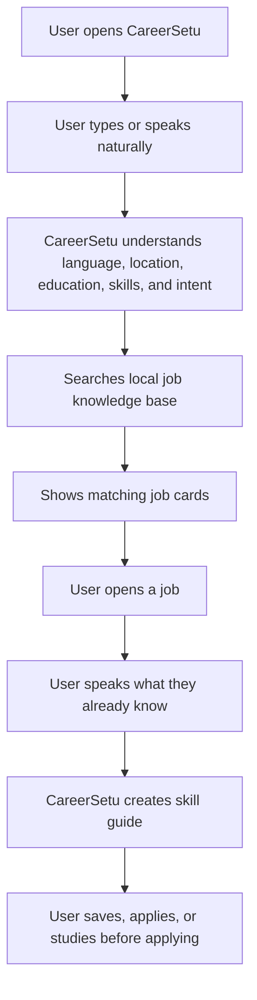
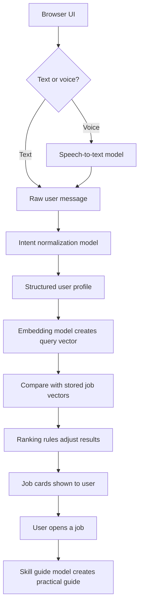

# CareerSetu

CareerSetu is a voice-first job discovery and skill guide product for entry-level Indian job seekers.

The product is built for users who may not know how to search job portals with exact keywords. They can simply say what they know:

```text
I am from Rajasthan, 12th pass, I know typing and basic computer. What jobs can I do?
```

CareerSetu understands the user's location, education, skills, and job intent. Then it shows relevant public and private opportunities, explains why a job can fit, and creates a practical skill guide for getting ready to apply.

## Product Idea

Most job platforms start with filters:

- job title
- company
- location
- salary
- experience

But many entry-level users do not think like that. They describe themselves:

- "I am 12th pass"
- "I know computer"
- "I am from West Bengal"
- "I can speak Hindi and Bengali"
- "I want typing work"
- "I need fresher job near me"

CareerSetu starts from the user, not from the job title.

The goal is simple:

1. Understand the person.
2. Find jobs that actually match them.
3. Explain the gap.
4. Tell them what to learn.
5. Help them apply with more confidence.

## Product Flow



## What The Product Does Today

The current prototype supports:

- chat-based job search
- voice-based job search
- Indian-language speech-to-text through OpenRouter
- conversion of regional-language input into English search intent
- profile extraction from natural language
- semantic job matching using embeddings
- practical ranking rules for education, role intent, and fresher suitability
- job detail view
- saved jobs
- applied jobs
- voice-only skill guide for each job
- skill guide in English and the user's detected language

The user does not see technical terms like model, embeddings, cache, or LLM in the UI. They only see simple job discovery and guidance.

## Example User Journeys

### Example 1: 12th Pass User Looking For Typing Work

User says:

```text
I am 12th pass from Rajasthan. I know typing and basic computer.
```

CareerSetu should understand:

- state: Rajasthan
- education: 12th pass
- skills: typing, basic computer
- likely intent: data entry, back office, computer operator, office assistant
- fresher-friendly requirement: yes

Good matches should be:

- data entry operator
- back office executive
- customer support chat process
- office assistant
- computer operator

Bad matches should be reduced:

- CA articleship
- senior accountant
- engineering role
- job requiring a specialized degree

### Example 2: B.Com User Looking For Office Or Accounts Work

User says:

```text
I am B.Com graduate. I know Excel and basic Tally. I want office work near Kolkata.
```

CareerSetu should understand:

- location: Kolkata / West Bengal
- education: graduate, commerce
- skills: Excel, Tally, accounts basics
- likely intent: accounts, billing, finance support, office admin

Good matches should be:

- account executive
- billing assistant
- office admin
- finance operations fresher
- back office executive

### Example 3: Hindi Voice Search

User speaks:

```text
Main barahvi pass hoon, Rajasthan se hoon, computer aur typing aati hai.
```

CareerSetu should:

1. Convert speech to text.
2. Detect that the user is speaking Hindi/Hinglish.
3. Normalize the meaning into English.
4. Extract education, state, and skills.
5. Search jobs using both meaning and practical filters.
6. Show matching jobs.
7. If the user asks for a skill guide, show it in Hindi/Hinglish plus English.

## Current Jobs Data

The current prototype uses local JSON files inside `data/`.

Current snapshot:

- total jobs: `207`
- fresher-friendly jobs: `207`
- private jobs from JobSpy/Indeed-style scraping: `203`
- public/NCS jobs: `4`
- job embeddings: available in `data/job_embeddings.json`
- enriched job summaries: available in `data/enriched_opportunities.json`

Current job categories:

| Category | Count |
| --- | ---: |
| Office / computer work | 98 |
| General entry-level | 44 |
| Sales / service | 41 |
| Logistics / delivery / warehouse | 11 |
| Financial services | 7 |
| Technical trade | 5 |
| Government exam / public role | 1 |

Current education split:

| Minimum education | Count |
| --- | ---: |
| ITI | 152 |
| 10th pass | 42 |
| 12th pass | 7 |
| Graduate | 6 |

Important limitation: this is still an early data snapshot. Location text exists in job descriptions, but state, district, city, salary, and apply method need better normalization in the next version.

## Data Sources

CareerSetu is planned around both private and public opportunities.

| Source | Type | Status | Why it matters |
| --- | --- | --- | --- |
| JobSpy / Indeed-style scraping | Private jobs | Used now | Good for fresher private jobs like office, support, sales, accounts, delivery, and computer work. |
| NCS.gov.in | Public/government-backed jobs | Small sample used now | Important for public opportunities, but needs better scraping and cleaning. |
| Apprenticeship India | Public apprenticeship source | Planned | Useful for ITI, diploma, 10th/12th pass, and fresher apprenticeship roles. |
| State job portals | Public jobs | Planned | Needed for state-specific government and semi-government roles. |
| Direct employer pages | Private jobs | Planned | Cleaner apply links and less duplicate/spam data. |

The next big improvement is not UI. It is data quality:

- scrape more reliable jobs
- normalize every job
- remove fake jobs
- identify direct apply links
- classify jobs by education and skill level
- store jobs in a proper database

## Technical Architecture

The easiest way to understand the architecture is through one user query.

User says:

```text
I am from Rajasthan, 12th pass, I know typing.
```

CareerSetu processes it like this:



## How The Models Work

CareerSetu uses different models for different jobs. This keeps the product useful while controlling cost.

| Step | Model variable | Default model | Why this model is used |
| --- | --- | --- | --- |
| Voice to text | `OPENROUTER_STT_MODEL` | `openai/gpt-4o-transcribe` | Converts spoken Hindi, English, Hinglish, and other supported languages into text. |
| Intent understanding | `OPENROUTER_CHAT_MODEL` | `openai/gpt-4o-mini` | Extracts simple structured meaning from user input, like state, education, skills, language, and job type. |
| Profile extraction | `OPENROUTER_CHAT_MODEL` | `openai/gpt-4o-mini` | Builds a reusable user profile from natural language without asking a long form. |
| Semantic search | `OPENROUTER_EMBEDDING_MODEL` | `openai/text-embedding-3-small` | Converts the user's query into a vector so matching can happen by meaning, not only exact words. |
| Skill guide | `OPENROUTER_GUIDE_MODEL` | `openai/gpt-4o` | Creates a deeper practical guide for a selected job, because this needs better reasoning and less generic advice. |

### Why Use Embeddings For Search?

Normal keyword search can fail when the user and job use different words.

Example:

```text
User says: I know typing and computer.
Job says: Back office executive with data entry and Excel work.
```

A pure keyword system may miss or rank this badly if the words do not match exactly.

Embeddings help because they store meaning. The system understands that:

- typing is close to data entry
- computer is close to office tools
- Excel is close to spreadsheet work
- back office is close to basic computer-based office jobs

Current prototype stores job embeddings in `data/job_embeddings.json`. For each search, it creates an embedding for the user's query and compares it with all stored job vectors.

This works for a prototype. For 50,000+ jobs, this should move to a vector database such as Neon Postgres with `pgvector`, so search can use indexing instead of comparing every job one by one.

## Skill Guide Architecture

The skill guide starts only after the user selects a job.

Example:

```text
Selected job: Customer Support Executive
User says: I know Hindi, basic English, WhatsApp, and computer.
```

The system sends the model:

- selected job title
- job description
- required skills
- user's known skills
- user's detected language
- product instruction to stay practical

The guide should explain:

- what the job actually does every day
- what the user already knows
- what is missing
- what should be learned before applying
- what can be learned after joining
- what to practice today
- what to search on YouTube
- what questions may come in interview
- what documents are needed before applying

For customer support, the system should not blindly tell the user to take a long paid course. A realistic answer is that customer support is often learned on the job, but the user should practice communication, typing, basic computer work, and handling customer questions.

## Language Support

The app currently supports language normalization for:

- English
- Hindi / Hinglish
- Bengali / Bangla
- Marathi
- Punjabi
- Gujarati
- Tamil
- Telugu
- Kannada
- Malayalam
- Odia
- Assamese
- Urdu

The current voice path uses OpenRouter speech-to-text. Later, Vakyam AI or another Indian-language voice provider can be added for stronger tier 2 and tier 3 speech support.

## Current Storage

The current prototype stores most data locally:

| Data | Current storage |
| --- | --- |
| Jobs | `data/opportunities.json` |
| Enriched job summaries | `data/enriched_opportunities.json` |
| Job vectors | `data/job_embeddings.json` |
| Saved jobs | Browser local storage |
| Applied jobs | Browser local storage |
| Generated guides | Browser-side guide cache |

This is enough for prototype testing. Production should move to:

- Neon Postgres for jobs, users, saved jobs, applied jobs, and guide history
- `pgvector` for job embeddings
- scheduled ingestion jobs for new data
- background enrichment jobs for cleaning and classification

## Project Structure

```text
api/
  index.js                         Vercel serverless entry point
CareerSetu/
  DEPLOYMENT.md                    Deployment notes
  TECHNICAL_ARCHITECTURE.md        Engineering architecture
  PRODUCT_WATERFALL.md             Product plan
data/
  opportunities.json               Current job dataset
  enriched_opportunities.json      Cleaned summaries and guide context
  job_embeddings.json              Local vector embeddings for semantic search
prompts/
  career_guide_master_prompt.md    Skill guide master prompt
prototype/
  index.html                       UI shell
  app.js                           Frontend logic
  styles.css                       UI styling
  server.js                        Local server and API handler
scripts/
  generate_job_embeddings.js       Embedding generation script
```

## Run Locally

Requirements:

- Node.js 18 or newer
- OpenRouter API key

Create the environment file:

```powershell
copy .env.example .env
```

Add the OpenRouter key in `.env`:

```env
OPENROUTER_API_KEY=your_key_here
```

Start the app:

```powershell
npm start
```

Open:

```text
http://127.0.0.1:5173/
```

Check the server:

```text
http://127.0.0.1:5173/api/health
```

## Environment Variables

```env
PORT=5173
HOST=127.0.0.1
OPENROUTER_API_KEY=
OPENROUTER_CHAT_MODEL=openai/gpt-4o-mini
OPENROUTER_GUIDE_MODEL=openai/gpt-4o
OPENROUTER_EMBEDDING_MODEL=openai/text-embedding-3-small
OPENROUTER_STT_MODEL=openai/gpt-4o-transcribe
```

For deployed hosting, use:

```env
HOST=0.0.0.0
```

Never commit `.env`.

## Deploy On Vercel

This repo includes the files Vercel needs:

- `api/index.js`
- `vercel.json`

Deploy steps:

1. Import the GitHub repo into Vercel.
2. Keep the root directory as the repo root. Leave it blank/default or use `./`.
3. Set framework preset to `Other`.
4. Add environment variables:

```env
OPENROUTER_API_KEY=your_key_here
OPENROUTER_CHAT_MODEL=openai/gpt-4o-mini
OPENROUTER_GUIDE_MODEL=openai/gpt-4o
OPENROUTER_EMBEDDING_MODEL=openai/text-embedding-3-small
OPENROUTER_STT_MODEL=openai/gpt-4o-transcribe
HOST=0.0.0.0
```

5. Deploy or redeploy from the latest `main` branch.
6. Check:

```text
https://your-vercel-domain.vercel.app/api/health
```

If `openRouterConfigured` is `true`, the deployed app can read the OpenRouter key.

Then open:

```text
https://your-vercel-domain.vercel.app/
```

## Development Checks

Run syntax checks:

```powershell
npm run check
```

Regenerate embeddings after changing jobs:

```powershell
npm run embeddings
```

## Current Status

CareerSetu is a working prototype. It already demonstrates:

- voice-first job search
- multilingual intent normalization
- semantic job matching
- saved and applied job sections
- practical skill guide generation
- Vercel-compatible deployment

The biggest next step is improving the job database. Better data ingestion, state normalization, fake-job filtering, and direct apply links will make the product much stronger than a normal job search page.
